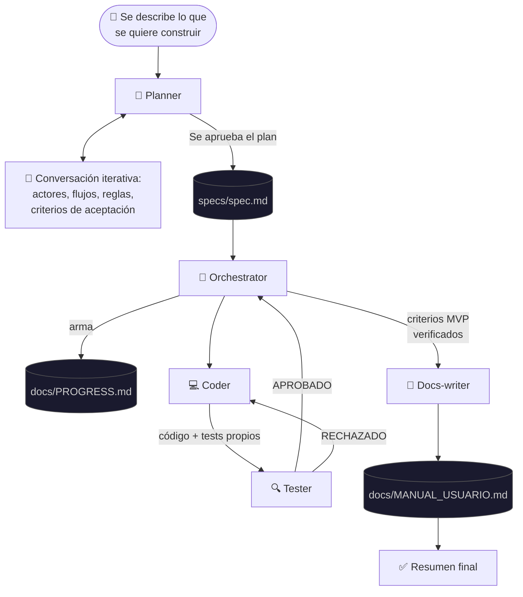
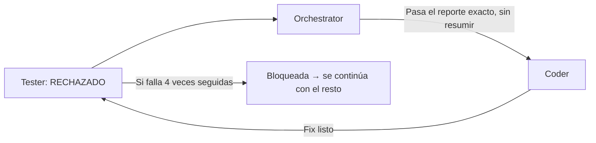
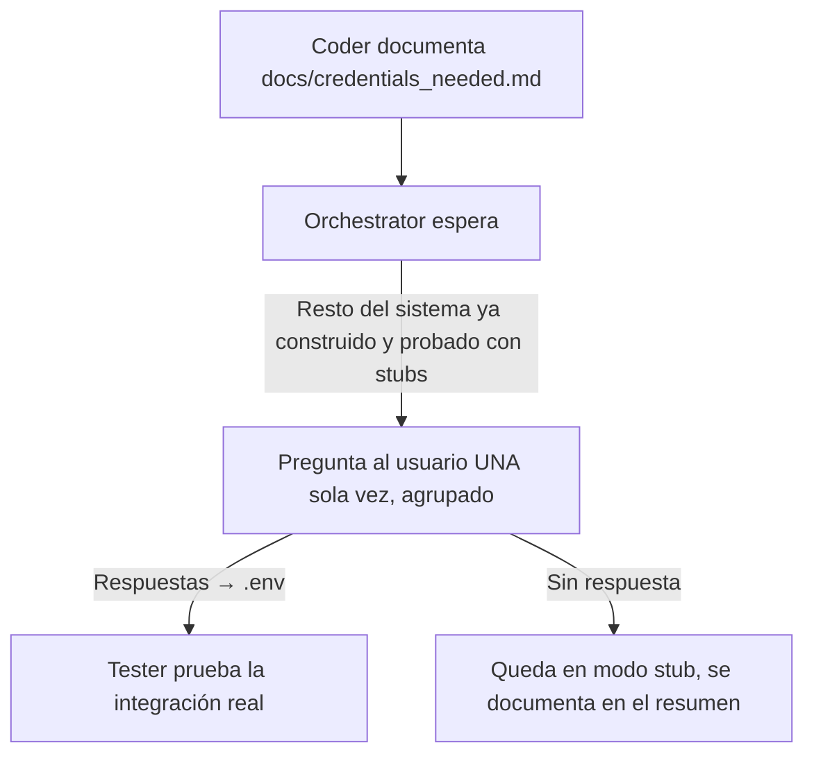
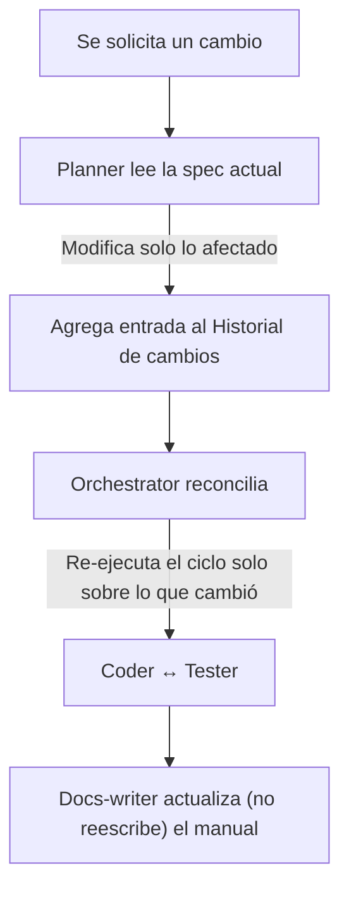
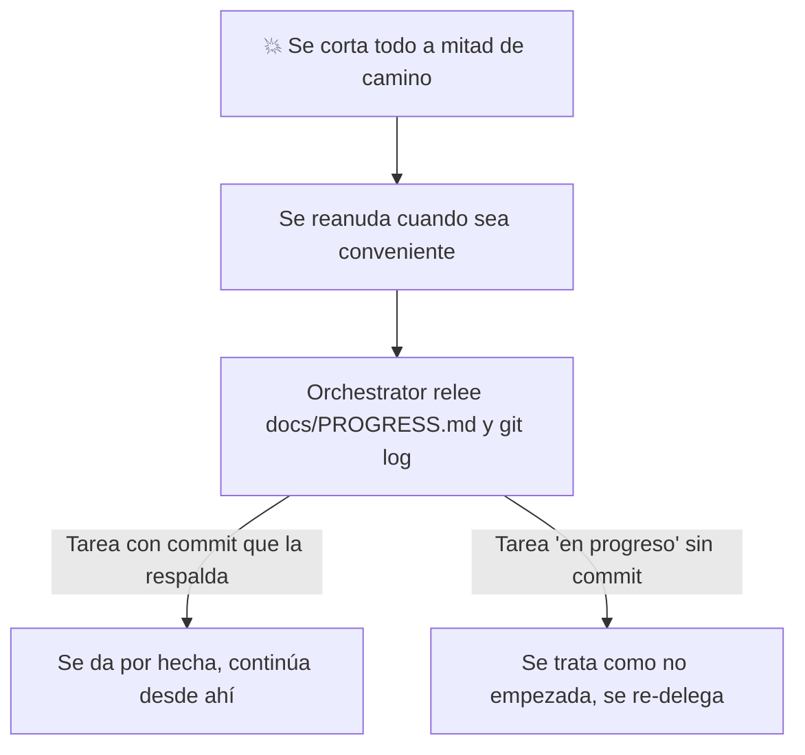

# Opencode Agents

> Un equipo de agentes personalizados para [opencode](https://opencode.ai) que automatizan el ciclo completo de desarrollo: desde la planificación hasta la documentación.

---

## Sobre este proyecto

Este es mi primer experimento armando un equipo de agentes de IA que colaboran entre sí. Empecé esto por pura curiosidad, tratando de entender cómo se coordina un equipo de IA en un flujo de desarrollo real, y terminó enganchándome la idea de que varios agentes con roles bien definidos puedan trabajar juntos como un equipo humano, pero corriendo en la terminal.

Diseñé cada agente pensando en roles concretos (analista, líder técnico, desarrollador, QA, redactor técnico), en cómo se pasan información entre sí, y en qué pasa cuando algo sale mal — bugs, credenciales faltantes, cambios de último momento, o directamente que se corte la ejecución a mitad de camino. Fue un buen ejercicio para pensar en serio sobre coordinación, límites, y qué decisiones se le delegan a una IA y cuáles no.

**Todavía no los he probado en un proyecto real.** Esta es la primera versión, pensada y diseñada con cuidado pero sin uso en producción todavía. La idea es justamente eso: ponerlos a prueba, ver qué falla, e iterar. Si alguien los prueba antes que yo, sería excelente conocer los resultados — se puede abrir un issue o enviar un mensaje.

---

## Qué es opencode

[opencode](https://github.com/anomalyco/opencode) es una herramienta de línea de comandos que usa modelos de lenguaje para tareas de software: edita archivos, ejecuta comandos, y conversa desde la terminal. Soporta **agentes personalizados** — instrucciones y permisos específicos que le dan a cada "rol" un comportamiento propio, y permite que un agente delegue trabajo en otros mediante subagentes.

## La idea detrás del diseño

Este equipo sigue un patrón conocido como **orchestrator-worker** (o arquitectura jerárquica hub-and-spoke): un coordinador central que descompone el trabajo y lo delega en agentes especializados, en vez de un solo agente gigante tratando de hacer todo. Es el mismo patrón que usan varios sistemas multiagente de investigación.

A nivel de proceso, se tomaron prestadas algunas prácticas de desarrollo de software:

- **BDD (Behavior-Driven Development)**: los criterios de aceptación se escriben en formato Given/When/Then.
- **ATDD (Acceptance Test-Driven Development)**: nada se considera "hecho" hasta que un criterio de aceptación pasa una prueba real, no solo porque "debería funcionar".
- **Specification by Example**: la spec es un documento vivo y versionado, no un requerimiento que se lee una vez y se olvida.
- **Kanban**: el progreso se trackea en un tablero de estados simple (`docs/PROGRESS.md`).

No es una adaptación purista de ninguna de estas — se ajustaron a lo que tenía sentido para un equipo de agentes, no de personas.

---

## Los agentes

### 🧭 planner — el único con el que se conversa directamente

Es un analista/product manager. Su trabajo es conversar con el usuario hasta tener un plan completo y sin ambigüedades: actores, entidades, flujos, reglas de negocio, casos límite, requisitos no funcionales, integraciones externas, stack técnico. No escribe código ni implementa nada — su única salida es `specs/spec.md`, con los criterios de aceptación numerados y una Definición de Hecho clara. Una vez aprobado el plan, es el único agente que invoca al `orchestrator` — no hace falta hablar con nadie más del equipo directamente.

### 🎯 orchestrator — el líder técnico (invisible para el usuario)

Es un subagente oculto: nunca se invoca manualmente, solo lo hace el `planner`. Lee la spec, arma un plan de tareas ordenado por dependencias, y coordina el ciclo de `coder` ↔ `tester` hasta que todos los criterios de aceptación pasan. Mantiene `docs/PROGRESS.md` como fuente de verdad del avance, hace commits atómicos, y es el único que puede pausar para pedir credenciales reales de una integración externa — una sola vez, agrupadas, y solo si hace falta.

### 💻 coder — quien implementa

Recibe tareas puntuales del `orchestrator` y las implementa siguiendo buenas prácticas: maneja errores explícitamente, valida entradas, escribe sus propios tests unitarios, y nunca hardcodea secretos (usa variables de entorno con un modo "stub" para integraciones externas que todavía no tienen credenciales reales). No puede invocar a nadie más — su trabajo termina cuando entrega y reporta al `orchestrator`.

### 🔍 tester — el que no se conforma con "debería funcionar"

El agente de QA. Prueba cada entrega en varios niveles (unitario, integración, end-to-end), busca activamente bugs comunes y raros (validación de entradas, condiciones de carrera, estados de error, límites), corre regresión sobre lo que ya estaba funcionando, y aprueba o rechaza con un reporte estructurado. Si algo fue implementado contra una integración externa sin credenciales reales, lo prueba con un stub y lo aclara explícitamente en vez de aprobarlo a ciegas.

### 📝 docs-writer — el traductor a lenguaje humano

Genera y mantiene `docs/MANUAL_USUARIO.md`: los flujos que un usuario final puede realizar en el sistema, en lenguaje simple, sin jerga técnica. Contrasta lo que dice la spec contra lo que realmente quedó implementado y verificado — si algo no se construyó, lo documenta como limitación en vez de inventarlo. En reentregas, actualiza solo lo que cambió, no reescribe todo desde cero.

---

## Modelos

Se usan modelos gratuitos disponibles vía [OpenCode Zen](https://opencode.ai/docs/zen/), la capa de modelos propia de opencode:

| Agente | Modelo | Por qué |
|---|---|---|
| `planner` | `opencode/big-pickle` | El más potente del lote — conversa con el usuario y define todo lo que se construye, vale la pena la mejor calidad aquí |
| `orchestrator` | `opencode/big-pickle` | Sus decisiones de coordinación afectan a todo el resto del equipo |
| `coder` | `opencode/deepseek-v4-flash-free` | Rápido y confiable — es el que más llamadas hace, ejecutando el ciclo de implementación |
| `tester` | `opencode/mimo-v2.5-free` | Buen balance para análisis detallado sin ser tan pesado como el modelo de planning |
| `docs-writer` | `opencode/mimo-v2.5-free` | La tarea más liviana del equipo — redactar a partir de información ya generada, no necesita el modelo más fuerte |

Son modelos en beta gratuita del proveedor: pueden fallar, tener límites de uso, o cambiar de nombre. Si alguno no rinde bien en su rol, basta con cambiar el campo `model:` del frontmatter — no requiere tocar nada más del diseño. Ejecutar `/models` en la interfaz muestra los identificadores vigentes.

---

## Flujo principal



En resumen:

1. Se le describe al `planner` qué sistema se necesita.
2. El `planner` arma una spec completa (`specs/spec.md`) y pide confirmación explícita.
3. Aprobada, el `orchestrator` toma el control — no hace falta intervenir salvo lo del punto 5.
4. Itera entre `coder` (implementar) y `tester` (verificar) hasta que todos los criterios de aceptación pasan, con regresión al final.
5. `docs-writer` genera el manual de usuario.
6. El `planner` entrega un resumen de todo lo construido.

---

## Otros flujos

### Qué pasa si un test falla



- El `orchestrator` le pasa al `coder` el reporte del `tester` tal cual, sin reinterpretarlo.
- Si tras 4 intentos la tarea sigue fallando, se marca `bloqueada` en `docs/PROGRESS.md` y se continúa con el resto del sistema en vez de repetir el ciclo indefinidamente.
- Al final se corre una pasada de regresión sobre todo el sistema, no solo sobre lo último modificado.

### Qué pasa si se necesitan credenciales externas



- El sistema arranca y funciona completo sin ninguna credencial real (modo stub para cualquier integración externa).
- Las credenciales se piden una sola vez, todas juntas — nunca una pausa por cada variable.
- Si no se proveen, la integración queda simulada y se anota como pendiente en el resumen final.

### Qué pasa si la spec cambia a mitad de camino



- No se reescribe la spec entera desde cero — el `planner` edita solo lo afectado y deja un registro estructurado del cambio.
- El `orchestrator` reconcilia leyendo esa entrada puntual, no comparando todo el documento.
- Solo se re-ejecuta el ciclo sobre las tareas realmente afectadas; lo demás queda intacto.

### Qué pasa si se corta la ejecución (se apaga la máquina, se cierra la terminal)



- Al reanudar, el `orchestrator` nunca confía en lo que "recuerda" de la conversación — relee `docs/PROGRESS.md` y `git log` como única fuente de verdad.
- Si una tarea figura "en progreso" pero no hay un commit que la respalde, se descarta y se vuelve a delegar desde cero.
- Es preferible repetir un poco de trabajo que asumir algo que nunca quedó guardado en disco.

---

## Permisos por agente

| Agente | Editar archivos | Ejecutar comandos | Invocar otros agentes | Preguntar al usuario |
|---|---|---|---|---|
| `planner` | Solo `specs/**` | Solo `git add`/`commit` sobre la spec | Solo `orchestrator` | Sí (es primary, conversa directamente) |
| `orchestrator` | ✅ | ✅ | `coder`, `tester`, `docs-writer` | Sí, vía tool `question` (solo credenciales) |
| `coder` | ✅ | ✅ | ❌ | ❌ |
| `tester` | ✅ | ✅ | ❌ | ❌ |
| `docs-writer` | ✅ | ❌ | ❌ | ❌ |

Esto garantiza que cada agente solo pueda hacer lo que le corresponde a su rol. El `coder`, por ejemplo, no puede invocar al `tester` directamente — esa decisión es exclusiva del `orchestrator`.

---

## Instalación

1. Clonar este repositorio:
   ```bash
   git clone https://github.com/TU-USUARIO/opencode-agents.git
   ```
2. Copiar los agentes necesarios a la carpeta de configuración de opencode:
   ```bash
   mkdir -p ~/.config/opencode/agents
   cp opencode-agents/agents/*.md ~/.config/opencode/agents/
   ```
   (o a `.opencode/agents/` dentro de un proyecto puntual, si se prefiere que apliquen solo ahí)
3. Reiniciar opencode.
4. Verificar que los agentes estén disponibles con `/agents`.

> Para entender mejor cómo funcionan los agentes, permisos, subagentes y modelos en opencode, se recomienda revisar la [documentación oficial](https://opencode.ai/docs) — en especial la sección de [agentes](https://opencode.ai/docs/agents/).

### Instalación selectiva

Si no se necesita todo el equipo, se puede copiar solo lo indispensable. El mínimo para el ciclo completo es `planner.md`, `orchestrator.md`, `coder.md` y `tester.md` — `docs-writer.md` es opcional (sin él, simplemente no se genera el manual de usuario al final).

---

## Personalización

Cada agente es un archivo `.md` con un frontmatter que controla su comportamiento:

```yaml
---
description: Descripción breve
mode: subagent          # primary o subagent
model: opencode/mimo-v2.5-free  # modelo a usar
steps: 40                # máximo de pasos antes de detenerse
permission:
  edit: allow             # puede editar archivos
  bash: allow              # puede ejecutar comandos
  task: deny                # puede invocar otros agentes
---
```

Elementos que se pueden modificar sin romper el diseño:

- **Modelo**: cambiar `model:` por el que se prefiera (gratuito o de pago).
- **Pasos**: ajustar `steps:` según la complejidad de cada tarea.
- **Permisos**: habilitar o restringir capacidades según el nivel de confianza deseado.
- **Instrucciones**: editar el cuerpo del `.md` — ahí vive todo el comportamiento real del agente.

### Agregar un agente nuevo

1. Crear `mi-agente.md` en `~/.config/opencode/agents/` (o `.opencode/agents/` del proyecto).
2. Definir el frontmatter con sus permisos.
3. Escribir sus instrucciones.
4. Si se quiere que otros agentes puedan invocarlo, agregarlo a la lista de `task` permitidos del `orchestrator`.

---

## Estructura del repositorio

```
opencode-agentsTeam/
├── README.md              # Este archivo
└── agents/
    ├── planner.md          # Analista/product manager
    ├── orchestrator.md     # Líder técnico
    ├── coder.md            # Ingeniero de software
    ├── tester.md            # Ingeniero de QA
    └── docs-writer.md      # Redactor técnico
```

---

## A futuro

- Probar estos agentes en un proyecto real de principio a fin y documentar los resultados.
- Ajustar los prompts según lo que se vaya encontrando en la práctica — es probable que algo no funcione exactamente como se pensó en el diseño.
- Evaluar agregar agentes especializados (seguridad, arquitectura de datos) si aparece un caso que realmente lo justifique.
- Seguir explorando qué modelos gratuitos rinden mejor en cada rol.

Cualquier persona que pruebe este equipo antes, o tenga sugerencias, puede abrir un issue — es mi primer proyecto de este tipo y cualquier retroalimentación ayuda a mejorarlo.

---
